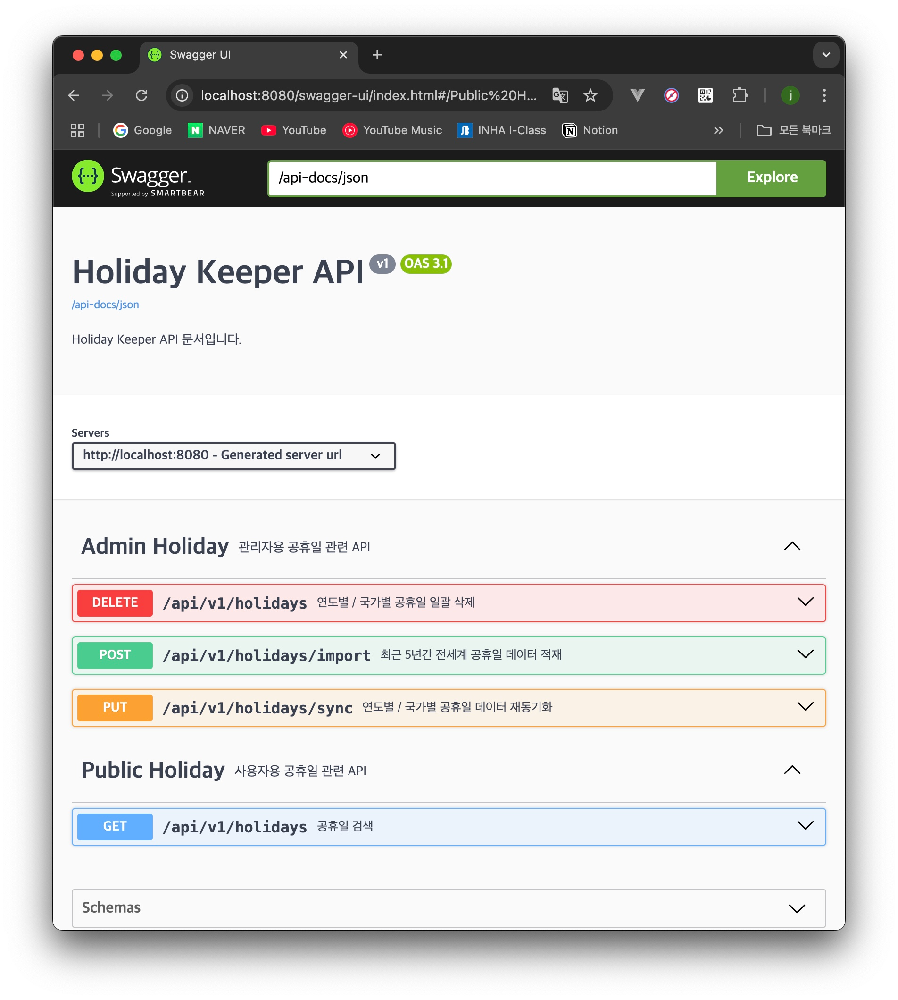
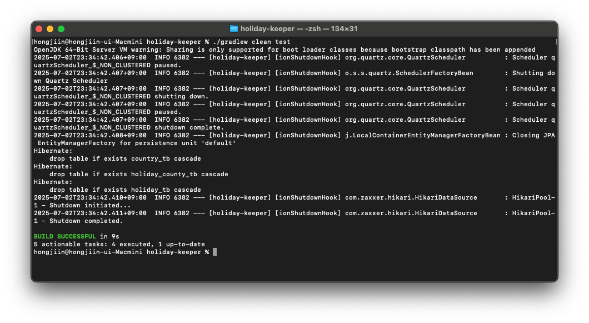
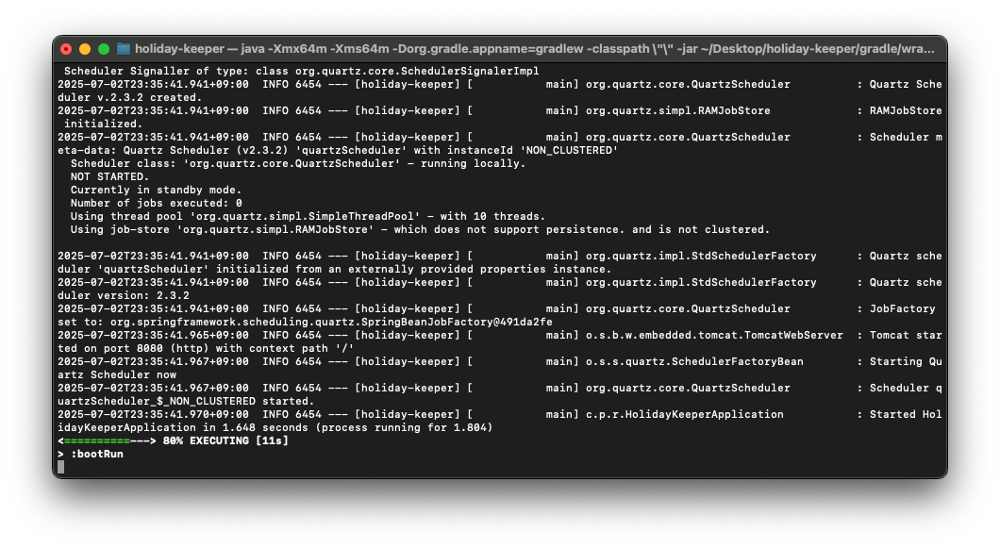

# holiday-keeper
Holiday Keeper: Global Holiday Data Management Service

---

## 빌드 및 실행 방법
1. Repository Clone

```shell
  git clone https://github.com/JIN-076/holiday-keeper
```

2. Build Application

```shell
  cd holiday-keeper/
  ./gradlew bootRun
```

3. 브라우저에서 API 명세 접속

```shell
  http://localhost:8080/api-docs
```

4. API 테스팅

<Br>

## REST API 명세 요약

### 1. 데이터 적재 API ###

#### Request
- Method: `POST`
- URL: `/api/v1/holidays/import`

#### Response
HolidayLoadResponse.class

- Status: `201 Created`
- Body:
```json
{
  "success": true,
  "summary": {
    "totalYears": 5,
    "totalCountries": 117,
    "totalHolidays": 9872,
    "succeedChunks": 24,
    "failedChunks": 0
  },
  "timestamp": "2025-07-02T22:48:10.586775"
}
```

<Br>

### 2. 데이터 검색 API ###

#### Request
- Method: `GET`
- URL: `/api/v1/holidays`

##### Query Parameters (옵션)
| 이름        | 타입                        | 필수 | 기본값               | 설명                      |
|-----------|---------------------------|---|-------------------|-------------------------|
| year      | `string`                  | N | —                 | 검색할 연도                  |
| code      | `string`                  | N | —                 | 검색할 국가코드                |
| type      | `string`                  | N | —                 | 검색할 휴일 타입               |
| from / to | `date` (yyyy-mm-dd)       | N | —                 | 검색할 기간 (year과 동시 사용 불가) |
| pageable  | `CursorPaginationInfoReq` | Y | `null` `1` `DESC` | 커서 기반 페이지네이션 req        |

```text
CursorPaginationInfoReq
- cursorId: 마지막으로 조회한 커서 (아이템) ID, 최초 조회 시 null로 조회 => cursorId=
- pageSize: 한 번에 조회할 데이터 수
- sortOrder: 정렬 순서 

* Swagger API에서 테스트 시, 아무것도 넣지 않은 sortOrder= 상태로 테스트해주세요!
* 기본적으로 DESC 순서로 정렬되어서 조회됩니다! ASC는 아직 지원하지 않습니다!
```

**2025년 전세계의 공휴일 데이터 최초 조회**
```shell
  GET http://localhost:8080/api/v1/holidays?year=2025&cursorId=&pageSize=5&sortOrder=
```

**2025년 전세계의 공휴일 데이터 조회 (최초 X)**
```shell
  GET http://localhost:8080/api/v1/holidays?year=2025&cursorId=<마지막으로 조회한 id>&pageSize=5&sortOrder=
```

#### Response
HolidayInfoResponse.class

- Status: `20O OK`
- Body:
```json
{
  "data": [
    {
      "id": 1,
      "date": "2025-01-01",
      "localName": "새해",
      "name": "New Year's Day",
      "countryName": "South Korea",
      "type": "PUBLIC",
      "counties": []
    }
  ],
  "hasNext": true,
  "numberOfElements": 0,
  "size": 0
}
```

<Br>

### 3. 데이터 재동기화 API ###

#### Request
- Method: `PUT`
- URL: `/api/v1/holidays/sync`

##### Query Parameters (옵션)
| 이름        | 타입                        | 필수 | 기본값         | 설명        |
|-----------|---------------------------|---|-------------|-----------|
| year      | `string`                  | N | —           | 동기화할 연도   |
| code      | `string`                  | N | —           | 동기화할 국가코드 |

```java
if (year == null && code == null) // 최근 5년 X 전세계 공휴일 데이터 동기화
else if (year == null && code != null) // 해당 연도 X 전세계 공휴일 데이터 동기화
else if (year != null && code == null) // 해당 국가 X 최근 5년 공휴일 데이터 동기화
```

#### Response
HolidaySyncResponse.class

- Status: `200 OK`
- Body:
```json
{
  "success": true,
  "summary": {
    "totalYears": 1,
    "totalCountries": 1,
    "totalHolidays": 15,
    "succeedChunks": 1,
    "failedChunks": 0
  },
  "timestamp": "2025-07-02T21:36:53.90839"
}
```

<Br>

### 4. 데이터 삭제 API ###

#### Request
- Method: `DELETE`
- URL: `/api/v1/holidays`

##### Query Parameters (옵션)
| 이름        | 타입                        | 필수               | 기본값         | 설명       |
|-----------|---------------------------|------------------|-------------|----------|
| year      | `string`                  | N (둘 다 N일 수는 없음) | —           | 삭제할 연도   |
| code      | `string`                  | N                | —           | 삭제할 국가코드 |

```java
if (year == null && code == null) // 모든 데이터 삭제는 위험하다고 판단하여 지원하지 않음
else if (year == null && code != null) // 해당 연도 X 전세계 공휴일 데이터 삭제
else if (year != null && code == null) // 해당 국가 X 최근 5년 공휴일 데이터 삭제
else // 해당 국가의 해당 연도 공휴일 데이터 삭제
```

#### Response
HolidaySyncResponse.class

- Status: `200 OK`
- Body:
```json
{
  "success": true,
  "summary": {
    "totalYears": 1,
    "totalCountries": 1,
    "totalHolidays": 15,
    "succeedChunks": 1,
    "failedChunks": 0
  },
  "timestamp": "2025-07-02T21:36:53.90839"
}
```

<Br>

### 5. 배치 자동화

- `Quartz` 스케줄러를 활용한 cron으로 매년 1월 2일 01:00 KST에 자동으로 배치 작업이 수행되도록 스케줄링
- API를 호출하는 방식으로 동작하지 않기 떄문에 API 명세 ❌
- 동기화 방식과 동일하게, 금년/작년 공휴일 데이터를 기존 데이터에 Upsert (덮어쓰기) 하도록 구현
- `log` 를 통해 수행된 배치 동기화 작업의 상태를 추적 가능

<Br>



<Br>

## 빌드 성공 스크린샷
1. `./gradlew clean test` 성공


2. `./gradlew bootRun` 성공


<Br>

## Swagger UI 노출 확인 방법
1. `./gradlew bootRun` 명령어를 통해 애플리케이션 구동
2. 웹 브라우저에서 `http://localhost:8080/api-docs` 접속